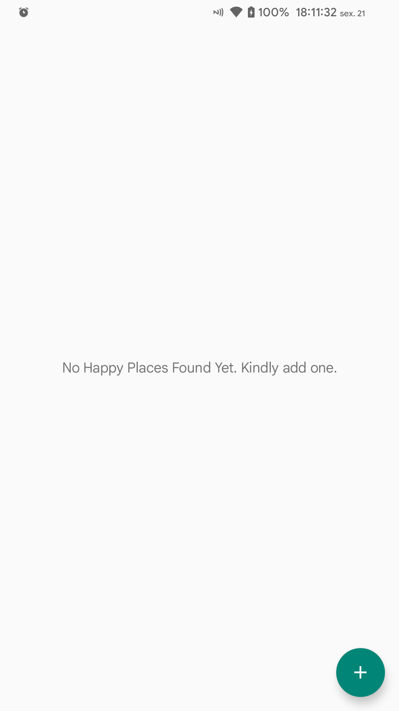
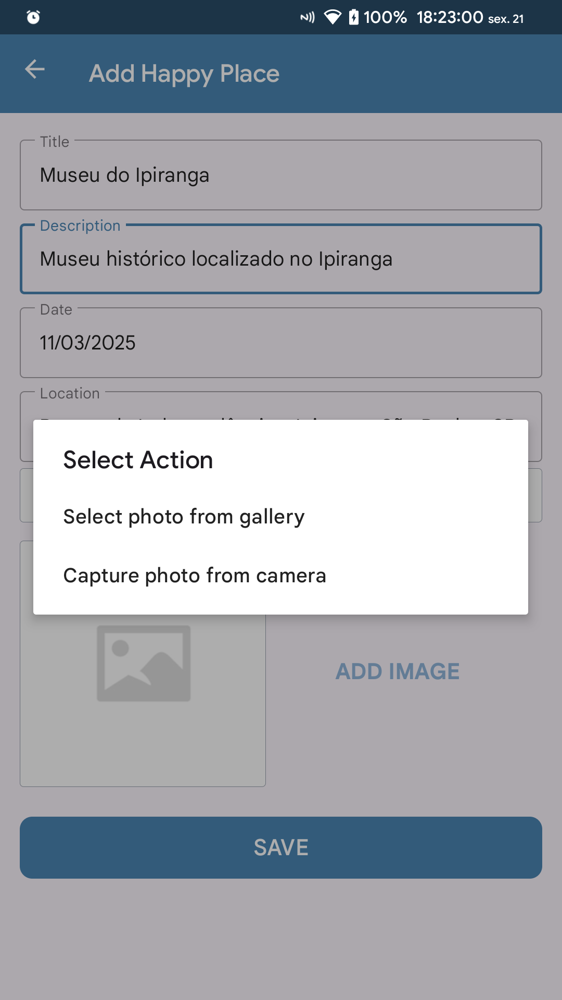
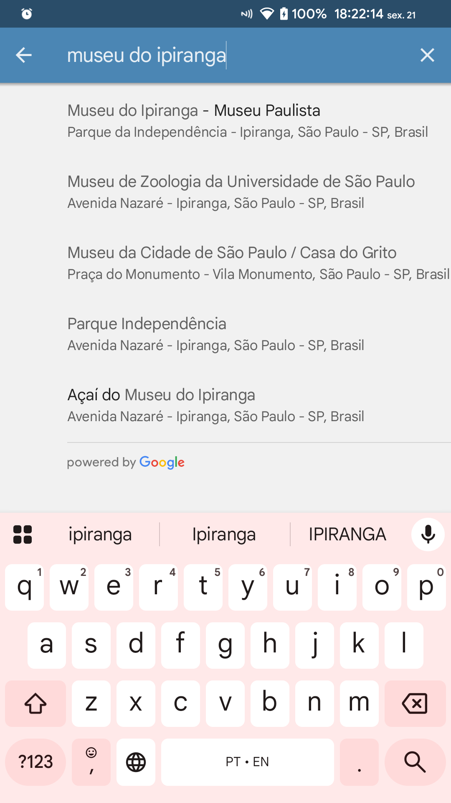
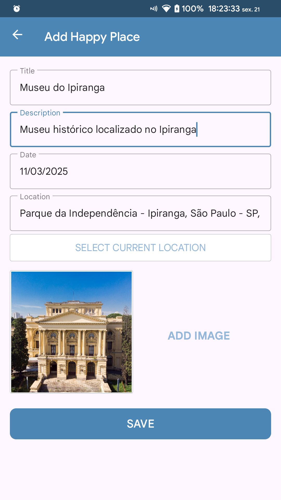
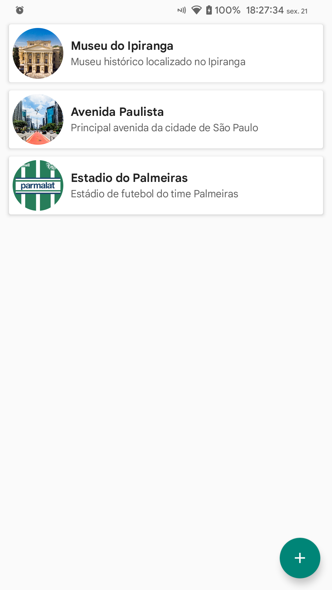
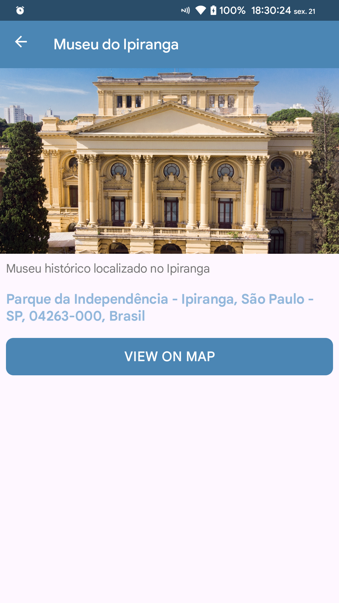
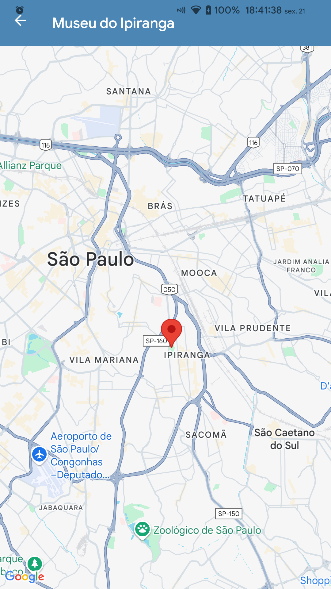
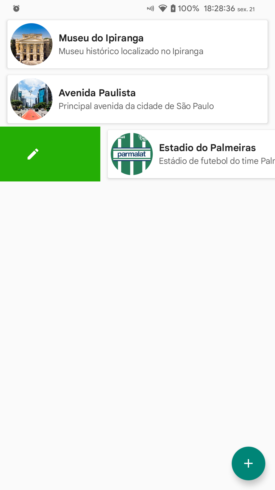
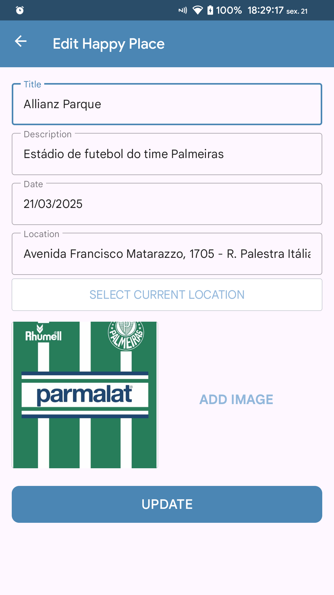
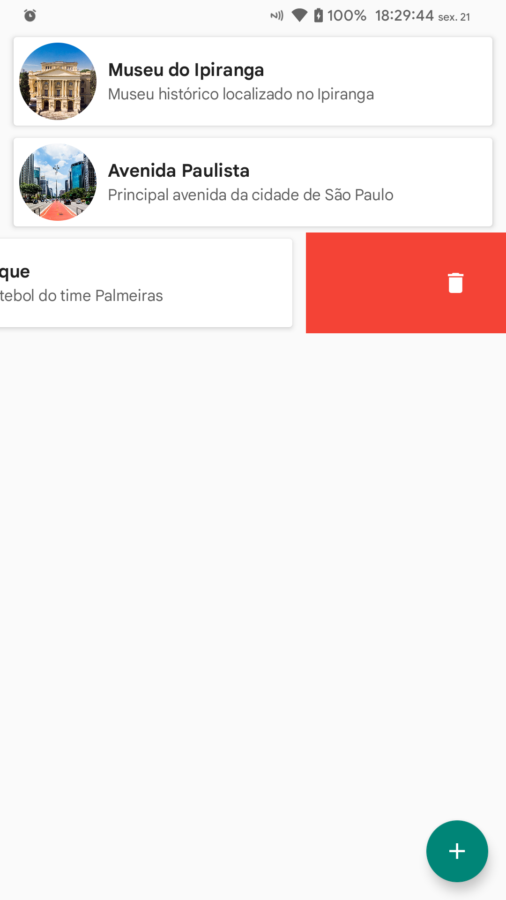

# HappyPlacesApp
Aplicativo Android de seus lugares favoritos

## Objetivo
Adicionar, atualizar ou deletar os lugares favoritos e visualizar seus detalhes

## Funcionalidades
- Adicionar um lugar favorito
- Atualizar informações do lugar
- Definir dia com DatePickerDialog
- Escolher foto/imagem do lugar
- Fornecer a localização atual
- Pesquisar a localização com base no nome/endereço
- Manter os lugares salvos no dispositivo
- Visualizar o lugar no mapa

## Linguagem
- Kotlin 
- XML

## Frameworks
- Google Maps
- Dexter (Permissions)
- SQLite (Local Database)

## Screenshots
         
